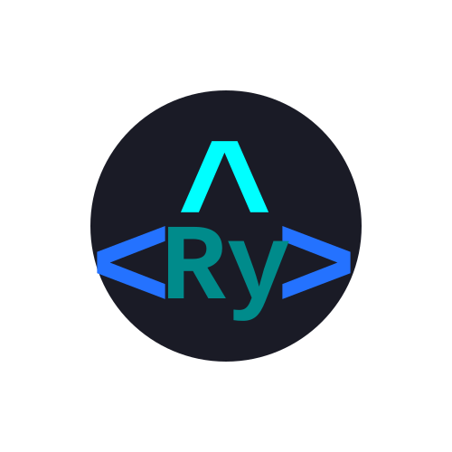
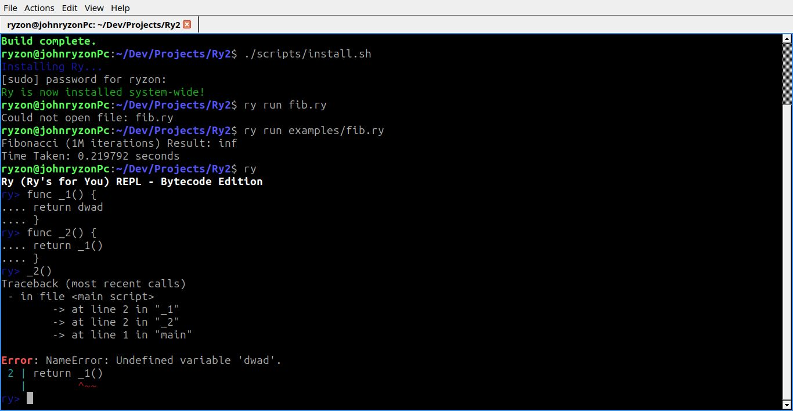

# Ry (Ry's for You) v2.1

<p align="center">
  
</p>
<p align="center">
  
</p>

Ry is a lightweight, robust, and english-like language designed with a focus on stability and developer experience. Whether you're building simple scripts or exploring language design, Ry is built to be helpful, colorful, and fast.

## Key Features

- **Intelligent Error Reporting**: Beautiful, color-coded error messages with caret pointers (`^~~`) and tracebacks to show you exactly where things went wrong.
- **Smart REPL**: A dynamic interactive shell with auto-indentation tracking and colorized prompts.
- **Built for Stability**: A memory-conscious C++ core that respects your hardware limits.
- **Improved version of Ry**: An optimized core interpreter using bytecode and registers with direct threading support.

## Performance

Ry is built to be efficient. With an optimized custom c++ core that uses custom bytecode without external tools like flex, bison, antlr or llvm.

## Installation

Ry comes with a built-in installer for Linux and Windows systems.

1. **Clone the repository:**
   ```bash
   $ git clone https://github.com/johnryzon123/Ry2.git
   $ cd Ry2
   ```
2. **Build and Install:**

```bash
$ chmod +x scripts/install.sh
$ ./scripts/build.sh
$ ./scripts/install.sh
```

## Usage

**The REPL**
Simply type `ry` to enter the Read Evaluate Print Loop (REPL).

```bash
$ ry
Ry (Ry's for you) REPL - Bytecode Edition
ry> out(0 to 10)
0..10
ry>
```

**Running a Script**

```bash
$ ry run script.ry
```

## Examples

```python
# Error reporting example
{
    print("Hello World") # Ry uses out() instead of print()
# Missing brackets or typos will be caught with helpful red pointers!
```

## Error reporting example

```bash
ry> _3()
Traceback (most recent calls)
 - in file <main script>
        -> at line 2 in "_1"
        -> at line 2 in "_2"
        -> at line 2 in "_3"
        -> at line 1 in "main"

Error: NameError: Undefined variable 'dwad'.
  2 | return _2()
    |         ^~~
```

## Documentation

- [Introduction](docs/01_Introduction.md)
- [Basics](docs/02_basics.md)
- [Classes](docs/03_Classes.md)
- [FFI](docs/04_FFI.md)

## License

This project is licensed under the MIT License - see the [LICENSE](LICENSE) file for details.
